# Project Aura - System Architecture

**Version:** 2.6
**Last Updated:** February 11, 2026
**Status:** All 9 Phases Deployed (Foundation, Data, Compute, Application, Observability, Serverless, Sandbox, Security, Scanning Engine)
**ADRs:** 84 Architecture Decision Records (83 Deployed/Accepted, 1 Proposed)

---

## Table of Contents

1. [High-Level Architecture](#high-level-architecture)
2. [Cloud Abstraction Layer](#cloud-abstraction-layer)
3. [Hybrid Deployment Architecture](#hybrid-deployment-architecture)
4. [Agentic Search System](#agentic-search-system)
5. [Context Retrieval Pipeline](#context-retrieval-pipeline)
6. [Agent Orchestration](#agent-orchestration)
7. [Orchestrator Deployment Modes](#orchestrator-deployment-modes)
8. [Sandbox Infrastructure](#sandbox-infrastructure)
9. [Network Architecture](#network-architecture)
10. [Data Flow](#data-flow)
11. [Security Architecture](#security-architecture)
12. [Deployment Topology](#deployment-topology)

---

## High-Level Architecture

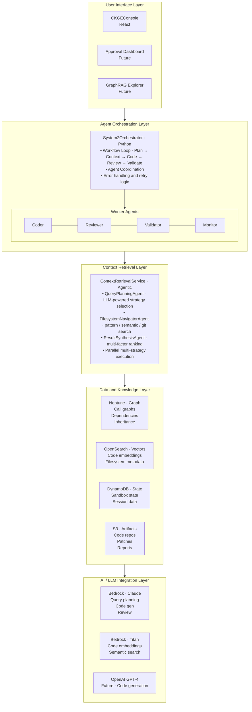

---

## Cloud Abstraction Layer

**Status:** Deployed (ADR-004) | **Implementation Date:** December 16, 2025

Project Aura supports multi-cloud deployment through a Cloud Abstraction Layer (CAL) that enables deployment to both AWS GovCloud and Azure Government.

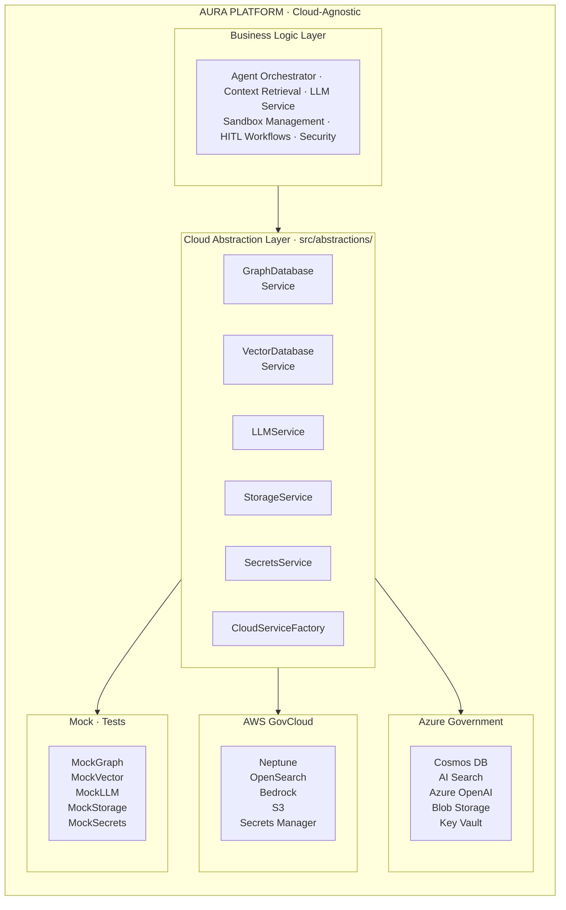

### Service Abstractions

| Service | Interface | AWS Implementation | Azure Implementation |
|---------|-----------|-------------------|---------------------|
| **Graph Database** | `GraphDatabaseService` | `NeptuneGraphAdapter` | `CosmosDBGraphService` |
| **Vector Database** | `VectorDatabaseService` | `OpenSearchVectorAdapter` | `AzureAISearchService` |
| **LLM Inference** | `LLMService` | `BedrockLLMAdapter` | `AzureOpenAIService` |
| **Object Storage** | `StorageService` | `S3StorageAdapter` | `AzureBlobService` |
| **Secrets Management** | `SecretsService` | `SecretsManagerAdapter` | `AzureKeyVaultService` |

### Usage

```python
from src.services.providers import CloudServiceFactory, get_graph_service

# Automatic provider selection from CLOUD_PROVIDER environment variable
graph = get_graph_service()

# Explicit provider selection
factory = CloudServiceFactory.for_provider(CloudProvider.AZURE_GOVERNMENT, "usgovvirginia")
graph = factory.create_graph_service()
vector = factory.create_vector_service()
llm = factory.create_llm_service()
```

**Reference:** See [ADR-004](../architecture-decisions/ADR-004-multi-cloud-architecture.md) for full design rationale and [MULTI_CLOUD_ARCHITECTURE.md](cloud-strategy/MULTI_CLOUD_ARCHITECTURE.md) for detailed implementation plan.

---

## Hybrid Deployment Architecture

**Strategy:** ECS Fargate for dev/sandboxes, EKS EC2 for production agents

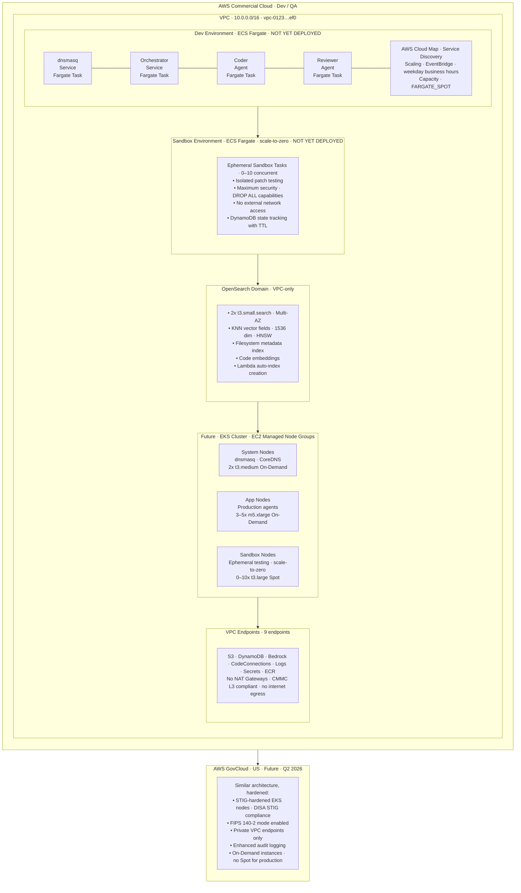

**Cost Summary:**
- **Phase 1 (Deployed):** $44/month (VPC Endpoints)
- **Phase 2 (Ready):** $231/month (ECS Fargate dev) + $70/month (OpenSearch) = **$345/month total**
- **Savings:** $440/month vs. always-on EKS EC2

---

## Agentic Search System

**Status:** ✅ Full Hybrid GraphRAG Complete (Dec 29, 2025)

Multi-strategy context retrieval system that combines graph, vector, filesystem, and git search for optimal code discovery within token budgets.

**Architecture:**

1. **QueryPlanningAgent** - LLM-powered strategy selection
   - Analyzes query intent and selects optimal search strategies (graph/vector/filesystem/git)
   - Estimates token costs and fits strategies to budget
   - Fallback to defaults if LLM unavailable

2. **Parallel Search Execution** (asyncio)
   - **Graph Search:** Neptune Gremlin with 5 query types (call graphs, dependencies, inheritance, references, related)
   - **Vector Search:** OpenSearch KNN (semantic similarity via embeddings)
   - **Filesystem Search:** OpenSearch metadata (glob patterns, wildcards)
   - **Git Search:** Recent changes, blame data, commit history

3. **ResultSynthesisAgent** - Multi-factor ranking & deduplication
   - Composite scoring: multi-strategy boost, recency, file size, module type
   - Budget fitting via greedy algorithm
   - Transparent ranking explanations

**Graph Search Query Types (Dec 29, 2025):**

| Query Type | Gremlin Pattern | Use Case |
|------------|-----------------|----------|
| `CALL_GRAPH` | Traverse `CALLS` edges | Find callers/callees of functions |
| `DEPENDENCIES` | Traverse `IMPORTS`/`DEPENDS_ON` edges | Trace package dependencies |
| `INHERITANCE` | Traverse `EXTENDS`/`IMPLEMENTS` edges | Find class hierarchies |
| `REFERENCES` | Match `REFERENCES` edges | Track symbol usage across codebase |
| `RELATED` | Multi-hop traversal | General semantic context discovery |

**Performance:** 3-5x better context quality for same token budget

**Detailed Documentation:** See [archive/implementation-snapshots/IMPLEMENTATION_AGENTIC_SEARCH.md](archive/implementation-snapshots/IMPLEMENTATION_AGENTIC_SEARCH.md)

---

## Context Retrieval Pipeline

**End-to-End Flow from Query to Context**

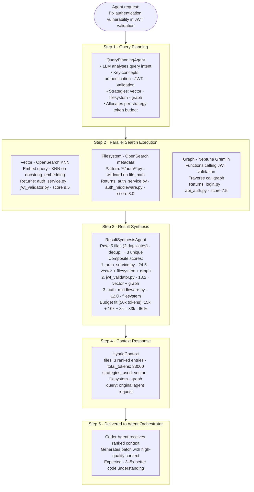

---

## Agent Orchestration

**Hybrid Warm Pool Architecture** (Recommended Pattern)

The Agent Orchestrator uses a cost-effective warm pool deployment pattern that provides zero cold start while minimizing infrastructure costs (~$28/month vs $175/month always-on).

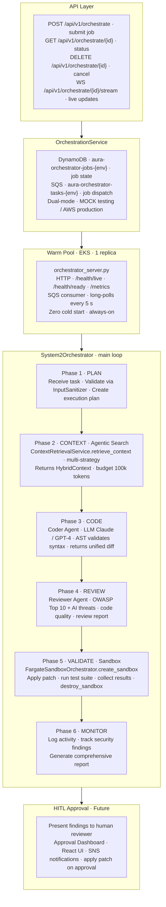

---

## Orchestrator Deployment Modes

**Status:** Implemented (December 15, 2025)

The Agent Orchestrator supports three configurable deployment modes, allowing organizations to optimize for cost, latency, or both. Modes can be configured at the platform level or with per-organization overrides.

### Available Modes

| Mode | Base Cost | Cold Start | Best For |
|------|-----------|------------|----------|
| **On-Demand** | $0/mo | ~30 seconds | Dev/test, low volume (<100 jobs/day) |
| **Warm Pool** | ~$28/mo | 0 seconds | Production, high volume (>500 jobs/day) |
| **Hybrid** | ~$28/mo + burst | 0 seconds | Variable workloads, enterprise |

### Mode Selection Architecture

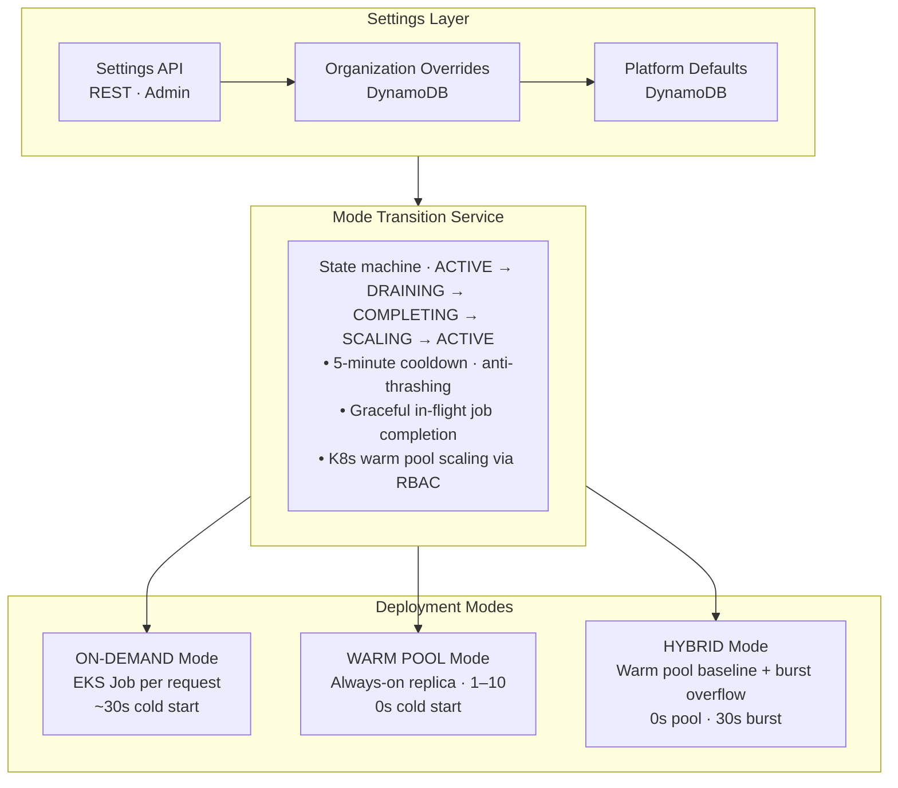

### API Endpoints

| Endpoint | Method | Description |
|----------|--------|-------------|
| `/api/v1/orchestrator/settings` | GET | Get current mode settings |
| `/api/v1/orchestrator/settings` | PUT | Update mode settings (admin) |
| `/api/v1/orchestrator/settings/modes` | GET | List available modes with details |
| `/api/v1/orchestrator/settings/switch` | POST | Explicitly switch mode (admin) |
| `/api/v1/orchestrator/settings/status` | GET | Current operational status |
| `/api/v1/orchestrator/settings/health` | GET | Health check |

### Per-Organization Overrides

Organizations can override platform defaults for customized deployment modes:

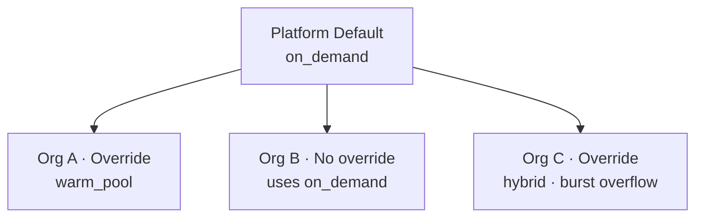

### CloudWatch Alarms

| Alarm | Trigger | Action |
|-------|---------|--------|
| Mode Thrashing | >3 mode changes in 1 hour | SNS notification |
| Warm Pool Not Ready | Ready < Desired for 5 min | SNS notification |
| Burst Overload | Burst jobs > max limit | SNS notification |

**Detailed Documentation:** See [docs/features/ORCHESTRATOR_MODES.md](features/ORCHESTRATOR_MODES.md)

---

## Sandbox Infrastructure

**Isolated Testing Environments**

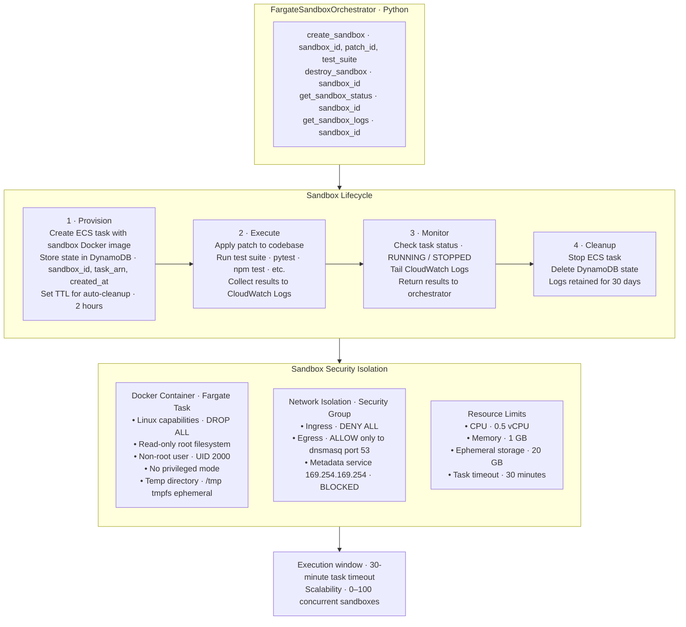

**DynamoDB State Tracking:**

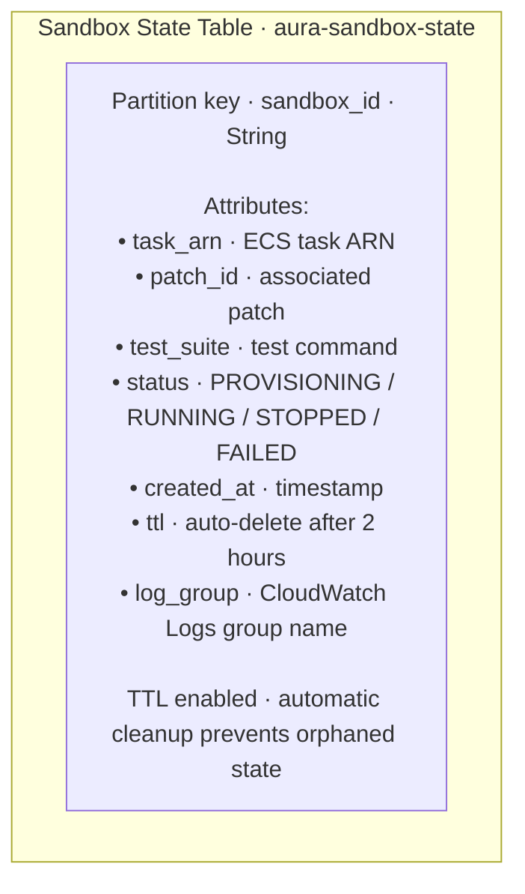

---

## Network Architecture

**Status:** ✅ Phase 1 Deployed (CMMC L3 Compliant)

**VPC Configuration:**
- **VPC:** vpc-0123456789abcdef0 (10.0.0.0/16)
- **Multi-AZ:** us-east-1a, us-east-1b (high availability)
- **Subnets:** Public (10.0.1-2.0/24), Private (10.0.11-12.0/24)
- **Internet Access:** VPC Endpoints only (no NAT Gateway - zero trust architecture)

**VPC Endpoints (No internet egress):**
- **Gateway Endpoints:** S3, DynamoDB (no cost)
- **Interface Endpoints ($44/month):** Bedrock Runtime, Bedrock Agent, CodeConnections, CloudWatch Logs, Secrets Manager, ECR API, ECR DKR

**3-Tier DNS Architecture (dnsmasq):**

1. **Tier 1: EKS DaemonSet** - Per-node DNS caching
   - 5ms average resolution, 50K cache, NetworkPolicy isolation

2. **Tier 2: ECS Fargate VPC-wide** - Centralized DNS service
   - Network Load Balancer, Multi-AZ HA, Auto-scaling

3. **Tier 3: Sandbox DNS** - Ephemeral per-sandbox configuration
   - Custom `.sandbox.aura.local` domain, Mock service endpoints

**Service Discovery Endpoints:**
- neptune.aura.local:8182
- opensearch.aura.local:9200
- context-retrieval.aura.local:8080
- orchestrator.aura.local:8080 (Agent Orchestrator warm pool)
- agent-orchestrator.default.svc.cluster.local:8080 (K8s ClusterIP)

**Performance:** 67% faster DNS resolution, 5x cache capacity, 40% cost reduction

**Detailed Documentation:** See [docs/integrations/DNSMASQ_INTEGRATION.md](integrations/DNSMASQ_INTEGRATION.md)

---

## Data Flow

**Query to Patch Generation**

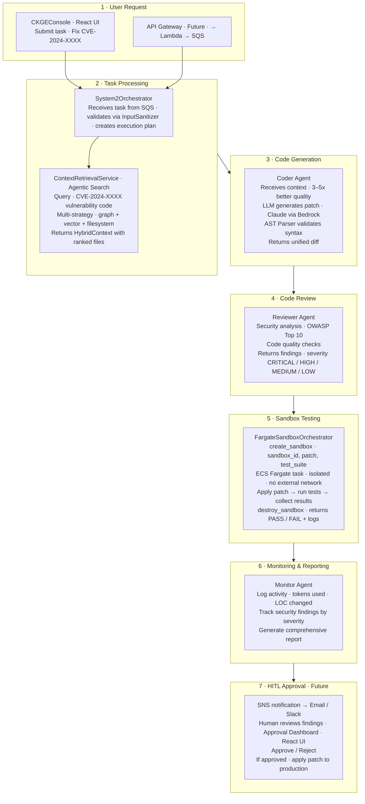

---

## Security Architecture

**Status:** Infrastructure controls: 96% GovCloud-ready | Security Services: 100% Deployed | CMMC Level 2 Progress: ~50-60%

> **Related Documentation:**
> - **Adaptive Security Intelligence:** `agent-config/agents/security-code-reviewer.md#adaptive-security-intelligence-workflow` - Proactive threat monitoring, assessment, and remediation workflow
> - **HITL Sandbox Architecture:** `docs/design/HITL_SANDBOX_ARCHITECTURE.md` - Human approval workflow for patches
> - **Compliance Clarification:** `docs/cloud-strategy/GOVCLOUD_READINESS_TRACKER.md#compliance-status-clarification` - Honest CMMC assessment
> - **Security Services Overview:** `docs/security/SECURITY_SERVICES_OVERVIEW.md` - Architecture and compliance mapping

7-layer defense-in-depth architecture with zero internet egress and comprehensive audit logging:

**Layer 1: Network Security**
- VPC isolation with VPC Endpoints only (no NAT Gateway)
- Security groups (least privilege), NetworkPolicy (pod isolation)
- Metadata service blocked (169.254.169.254)

**Layer 2: Container Security**
- Linux capabilities: DROP ALL, non-root user (UID 1000/2000)
- Read-only root filesystem, resource limits, ephemeral storage only

**Layer 3: Application Security**
- InputSanitizer for graph injection prevention
- Input validation, output encoding, secure LLM prompt templates

**Layer 4: Data Security**
- KMS encryption at rest with automatic key rotation
- TLS 1.2+ in transit, node-to-node encryption (OpenSearch)
- Secrets Manager (no environment variables)

**Layer 5: IAM & Access Control**
- Least-privilege policies (no wildcard resources)
- Service roles with temporary credentials, MFA for human access

**Layer 6: Monitoring & Audit**
- CloudWatch Logs (all actions), VPC Flow Logs (365-day retention)
- OpenSearch audit logs, CloudWatch Alarms, SNS notifications

**Layer 7: Security Services (Dec 12, 2025)**
- **Input Validation Service:** SQL injection, XSS, command injection, SSRF, prompt injection detection
- **Secrets Detection Service:** 30+ secret types with entropy-based detection
- **Security Audit Service:** Event logging with CloudWatch/DynamoDB persistence
- **Security Alerts Service:** P1-P5 priority alerts with HITL integration and SNS notifications
- **API Security Integration:** FastAPI decorators, middleware, rate limiting
- **Security Infrastructure:** EventBridge bus, SNS topic, 7 CloudWatch alarms, 3 log groups
- **Test Coverage:** 328 security-specific tests across all services

**Compliance:** CMMC Level 3, SOX, NIST 800-53, SOC2, WCAG 2.1 AA (future)

**Detailed Security Documentation:**
- [SECURITY_FIXES_QUICK_REFERENCE.md](SECURITY_FIXES_QUICK_REFERENCE.md)
- [docs/security/SECURITY_INCIDENT_RESPONSE.md](security/SECURITY_INCIDENT_RESPONSE.md)
- [docs/security/DEVELOPER_SECURITY_GUIDELINES.md](security/DEVELOPER_SECURITY_GUIDELINES.md)
- [docs/security/SECURITY_SERVICES_OVERVIEW.md](security/SECURITY_SERVICES_OVERVIEW.md)

---

## Deployment Topology

**Current State (Phase 1 + Phase 2 Ready)**

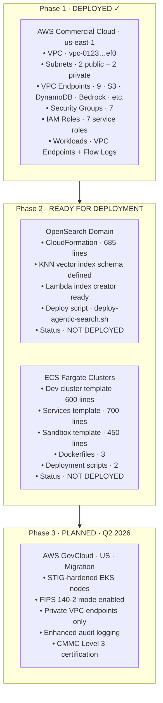

---

## Summary

**Project Aura System Architecture - February 11, 2026**

**Key Achievements:**
- ✅ **All 8 Infrastructure Phases Deployed** - Foundation, Data, Compute, Application, Observability, Serverless, Sandbox, Security
- ✅ **84 ADRs (83 Deployed/Accepted, 1 Proposed)** - Architecture Decision Records
- ✅ **Full Hybrid GraphRAG Complete** - Vector + Graph + BM25 search with 5 query types (Issue #151)
- ✅ **Agent Orchestrator Warm Pool** - Cost-effective hybrid architecture (~$28/month vs $175/month)
- ✅ **UI-Configurable Deployment Modes** - On-demand, warm pool, and hybrid with per-org overrides
- ✅ **Cloud Abstraction Layer (ADR-004)** - Multi-cloud AWS/Azure support, 5 service abstractions
- ✅ **Titan Neural Memory (ADR-024)** - 237 tests, 5 phases deployed, cognitive architecture operational
- ✅ **Context Engineering (ADR-034)** - 7 services deployed: scoring, registry, stack, retrieval, hoprag, mcp, summarization
- ✅ **AWS Agent Parity (ADR-037)** - 27 services total: AgentCore, Security, DevOps, Transform, Phase 2
- ✅ **EKS Cluster Operational** - EC2 Managed Node Groups for GovCloud compatibility
- ✅ **Security Services Deployed** - 5 Python services, 328 tests, CloudFormation infrastructure
- ✅ **IAM Permissions Scoped** - Neptune/RDS and OpenSearch permissions scoped to project-specific ARNs
- ✅ **8,113 Tests Passing** - Comprehensive test coverage including 328 security tests
- ✅ **Comprehensive Documentation** - Security incident response, developer guidelines, compliance mapping

**Architecture Highlights:**
- **Hybrid Deployment:** ECS Fargate (dev/sandboxes) + EKS EC2 (production)
- **Agent Orchestrator:** Warm pool deployment with SQS job dispatch and DynamoDB state
- **Hybrid GraphRAG:** Vector (semantic) + Graph (structural) + BM25 (keyword) search
- **Graph Query Types:** CALL_GRAPH, DEPENDENCIES, INHERITANCE, REFERENCES, RELATED
- **Security:** 7-layer defense-in-depth with CMMC Level 3 compliance
- **Security Services:** Input validation, secrets detection, audit, alerts, API integration
- **Cost Optimization:** $440/month savings through scale-to-zero and FARGATE_SPOT

**Overall Completion:** 99%

**Security Metrics:**
- 5 Python security services operational
- 328 security-specific tests
- 7 CloudWatch security alarms
- 3 CloudWatch log groups (90-day retention)
- 1 EventBridge bus + 2 rules
- 1 SNS topic with email subscriptions
- CMMC, SOC2, NIST 800-53 compliance mapping

**Deployed** to AWS Commercial Cloud with clear path to GovCloud migration.

---

**Document Version:** 2.6
**Last Updated:** February 11, 2026
**Status:** Current and Accurate
**ADRs:** 84 Architecture Decision Records (83 Deployed/Accepted, 1 Proposed)
