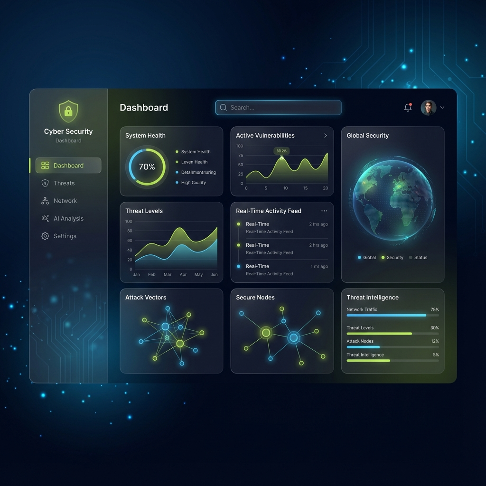

# Design Exploration & Modernization Walkthrough

I have completed the design analysis and modernization proposal for Project Aura. This document summarizes the potential next steps for the UI/UX.

## 1. Current State Analysis
I created a pixel-perfect HTML mockup of the current design system to understand the baseline.
- **Current Design Style**: Clean, enterprise-standard, "Anthropic-inspired" with olive accents.
- **File**: [current_design_mockup.html](./current_design_mockup.html)
- **Observations**: Functional and clean, but lacks the "premium" and "futuristic" feel requested for a high-end security tool.

## 2. Proposed "Sci-Fi Enterprise" Design
I designed a new aesthetic that moves towards a deeper, more immersive interface suitable for specialized security operations.

### Key Visual Changes
- **Deep Dark Mode**: Shifted from slate-50/900 to deep blue-black gradients (`bg-slate-950`).
- **Glassmorphism**: Heavy use of translucent panels with blur for depth.
- **Neon Accents**: Replacing standard colors with glowing variants (primary blue, neon olive, critical red).
- **Data Visualization**: Smooth gradient area charts and glowing node graphs.

### Visual Concept


## 3. Recreation System Prompt
To implement this design, I have prepared a detailed system prompt that defines the new design tokens and rules.

[view system_prompt.json](./system_prompt.json)

### System Prompt Preview
```json
{
  "system_prompt": {
    "name": "Project Aura - Advanced UI/UX Architect",
    "design_system": {
      "theme": "Deep Dark Mode",
      "colors": {
        "background": {
          "primary": "bg-slate-950",
          "gradient": "bg-gradient-to-br from-slate-950 via-[#0f172a] to-slate-900"
        },
        "surface": {
          "glass": "bg-slate-900/50 backdrop-blur-xl border border-white/10"
        }
      }
    }
  }
}
```

## Next Steps
- **Implementation**: Begin refactoring `index.css` and `tailwind.config.js` to adopt the new color palette and utility classes.
- **Component Update**: Update `MetricCard`, `Sidebar`, and main layout grid to use the new "glass" styles.
