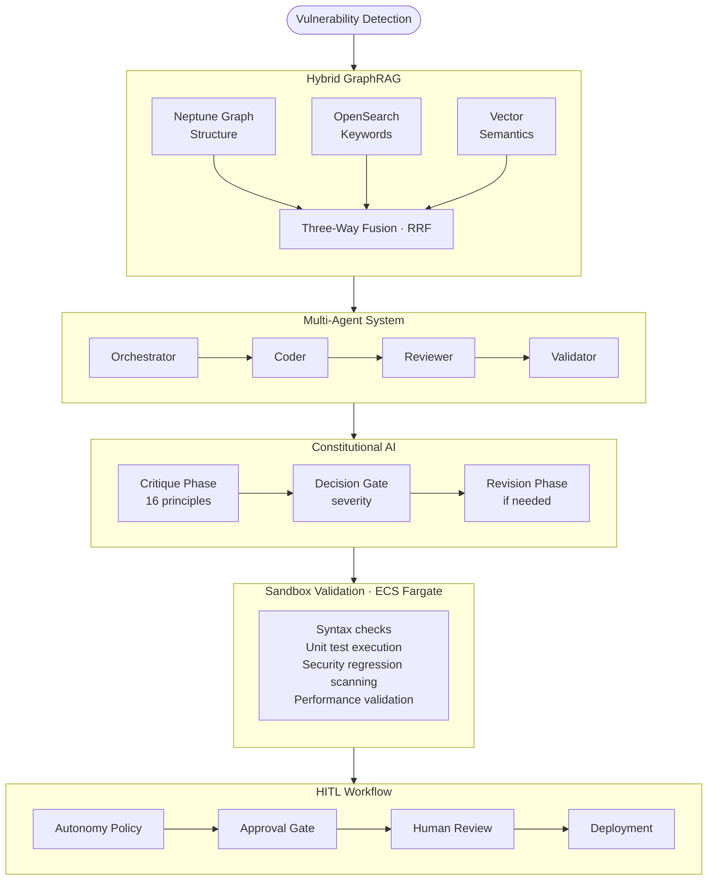

# Core Concepts

**Version:** 1.0
**Last Updated:** January 2026
**Product:** Project Aura by Aenea Labs

---

## Introduction

This section provides a deep dive into the technical foundations of Project Aura. While the Getting Started guide helps you become productive quickly, Core Concepts explains the architectural decisions and technologies that make Aura unique.

Understanding these concepts will help you:

- Configure Aura optimally for your organization's needs
- Troubleshoot complex scenarios
- Make informed decisions about autonomy levels and security policies
- Communicate Aura's value to technical stakeholders

---

## Core Technology Pillars

Project Aura is built on six interconnected technology pillars that work together to enable autonomous, secure code remediation.

### 1. Autonomous Code Intelligence

At its core, Aura is an AI system that understands code at a deep level. Unlike traditional security tools that rely on pattern matching, Aura uses large language models (LLMs) to reason about code structure, intent, and security implications.

**Key capabilities:**
- Context-aware vulnerability understanding
- Intelligent patch generation
- Confidence scoring and uncertainty quantification
- Continuous learning from remediation outcomes

[Learn more about Autonomous Code Intelligence](./autonomous-code-intelligence.md)

---

### 2. Hybrid GraphRAG Architecture

Aura's intelligence comes from its hybrid retrieval system that combines structural code analysis with semantic understanding. This "Hybrid GraphRAG" architecture uses both a graph database and a vector store to provide comprehensive code context.

**Key capabilities:**
- Graph-based code structure analysis (call graphs, dependencies, inheritance)
- Semantic similarity search for related code patterns
- Three-way retrieval fusion for optimal context
- Sub-50ms query latency at enterprise scale

[Learn more about Hybrid GraphRAG](./hybrid-graphrag.md)

---

### 3. Multi-Agent System

Aura does not rely on a single AI model. Instead, it orchestrates multiple specialized agents that collaborate to detect, remediate, and validate security issues. This multi-agent architecture provides robustness, specialization, and transparent decision-making.

**Key agents:**
- **Orchestrator** - Coordinates workflows and manages state
- **Coder Agent** - Generates security patches
- **Reviewer Agent** - Validates code against security policies
- **Validator Agent** - Tests patches in sandboxed environments
- **Monitor Agent** - Tracks health, costs, and performance

[Learn more about the Multi-Agent System](./multi-agent-system.md)

---

### 4. Constitutional AI

Aura implements Constitutional AI to ensure agent outputs align with explicit safety, compliance, and quality principles. Unlike traditional guardrails that simply block outputs, Constitutional AI engages constructively through a critique-revision pipeline that explains concerns and attempts to improve responses.

**Key capabilities:**
- 16 constitutional principles across 6 categories (Safety, Compliance, Anti-Sycophancy, Transparency, Helpfulness, Code Quality)
- Critique-revision pipeline with transparent reasoning
- Cost-optimized model selection (Haiku for critique, Sonnet for revision)
- Real-time Trust Center dashboard for visibility
- Nightly LLM-as-Judge evaluation for quality monitoring

[Learn more about Constitutional AI](./constitutional-ai.md)

---

### 5. Human-in-the-Loop Workflows

Enterprise security requires human oversight. Aura's configurable HITL (Human-in-the-Loop) system allows organizations to define exactly when human approval is required, balancing automation speed with governance requirements.

**Key capabilities:**
- Four configurable autonomy levels
- Industry-specific policy presets
- Guardrails that always require approval
- Complete audit trails for compliance

[Learn more about HITL Workflows](./hitl-workflows.md)

---

### 6. Sandbox Security Model

Every patch generated by Aura is validated in an isolated sandbox environment before reaching human reviewers. This ensures that AI-generated code is syntactically correct, functionally valid, and does not introduce new security issues.

**Key capabilities:**
- Ephemeral ECS Fargate environments
- Network-isolated test execution
- Automated regression detection
- Resource limits and timeouts

[Learn more about Sandbox Security](./sandbox-security.md)

---

## Recommended Learning Path

The Core Concepts documentation is designed to be read in order, with each section building on previous concepts.

### For Security Engineers

1. **[Autonomous Code Intelligence](./autonomous-code-intelligence.md)** - Understand how AI makes security decisions
2. **[Constitutional AI](./constitutional-ai.md)** - Learn about safety principles and anti-sycophancy
3. **[HITL Workflows](./hitl-workflows.md)** - Configure approval policies for your organization
4. **[Sandbox Security](./sandbox-security.md)** - Understand validation and isolation
5. **[Multi-Agent System](./multi-agent-system.md)** - Deep dive into agent interactions

### For Platform Engineers

1. **[Hybrid GraphRAG](./hybrid-graphrag.md)** - Understand the data architecture
2. **[Multi-Agent System](./multi-agent-system.md)** - Learn about agent orchestration
3. **[Constitutional AI](./constitutional-ai.md)** - Understand critique-revision pipeline
4. **[Sandbox Security](./sandbox-security.md)** - Configure sandbox environments
5. **[Autonomous Code Intelligence](./autonomous-code-intelligence.md)** - Tune AI parameters

### For Compliance Officers

1. **[Constitutional AI](./constitutional-ai.md)** - Review AI safety principles and audit trails
2. **[HITL Workflows](./hitl-workflows.md)** - Configure governance policies
3. **[Sandbox Security](./sandbox-security.md)** - Understand security boundaries
4. **[Autonomous Code Intelligence](./autonomous-code-intelligence.md)** - Review AI decision-making
5. **[Multi-Agent System](./multi-agent-system.md)** - Understand audit capabilities

---

## Concept Relationships

Understanding how these concepts interact helps you configure Aura effectively.

---

## Key Takeaways

| Concept | Primary Value | Key Decision |
|---------|---------------|--------------|
| **Autonomous Code Intelligence** | AI-powered security remediation | Confidence thresholds, model selection |
| **Hybrid GraphRAG** | Deep code understanding | Index configuration, retrieval weights |
| **Multi-Agent System** | Specialized, robust processing | Agent configuration, communication patterns |
| **Constitutional AI** | Principled safety and transparency | Failure policies, principle priorities |
| **HITL Workflows** | Governance and compliance | Autonomy level, approval policies |
| **Sandbox Security** | Safe validation | Timeout limits, resource allocation |

---

## Related Documentation

### Getting Started
- [Platform Overview](../getting-started/index.md) - High-level introduction to Aura
- [Quick Start Guide](../getting-started/quick-start.md) - Get running in 5 minutes
- [First Project](../getting-started/first-project.md) - Connect your first repository

### Operations
- [Monitoring and Observability](../../support/operations/monitoring.md) - CloudWatch dashboards, metrics, alerts
- [Performance Tuning](../../support/operations/scaling.md) - Scaling, capacity planning
- [Troubleshooting Guide](../../support/troubleshooting/index.md) - Common issues and solutions

### API Reference
- [REST API Documentation](../../support/api-reference/rest-api.md) - Endpoints, request/response formats
- [GraphQL Schema](../../support/api-reference/graphql-api.md) - GraphQL queries and mutations
- [Webhook Events](../../support/api-reference/webhooks.md) - Event payloads, retry logic

---

## Questions?

If you have questions about Core Concepts that are not answered in this documentation:

- **Documentation:** [docs.aenealabs.com](https://docs.aenealabs.com)
- **Support Portal:** [support.aenealabs.com](https://support.aenealabs.com)
- **Email:** support@aenealabs.com
